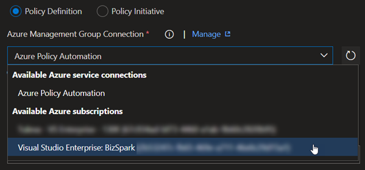
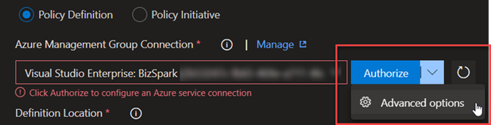
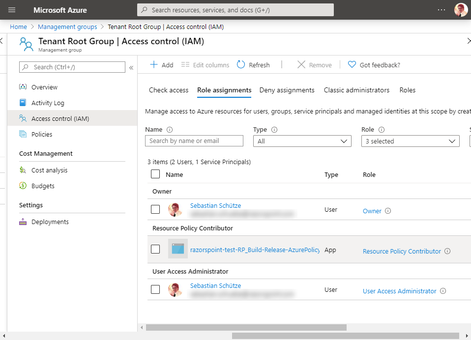

# Azure Policy Build and Release Tasks

This extension includes a group of tasks that can deploy Azure Policies and Initiatives.

**Note**: This project is used with GitHub and Azure DevOps projects features. Where GitHub is used for code and issues, but the complete build pipeline is hosted on Azure DevOps in the background.

* GitHub Project start page: [https://github.com/RazorSPoint/azure-devops-azure-policy-extension](https://github.com/RazorSPoint/azure-devops-azure-policy-extension)
* Build definitions: [https://dev.azure.com/razorspoint/RP_Build-Release-AzurePolicy/_build/latest?definitionId=19](https://dev.azure.com/razorspoint/RP_Build-Release-AzurePolicy/_build/latest?definitionId=19)
* Release definitions: [https://dev.azure.com/razorspoint/RP_Build-Release-AzurePolicy/_release?view=all&definitionId=1](https://dev.azure.com/razorspoint/RP_Build-Release-AzurePolicy/_release?view=all&definitionId=1)

## Content:

#### [Task: Deploy Azure Policy](#Task-Deploy-Azure-Policy)

##  Task Deploy Azure Policy

This task is intended to make it easier for you to publish Azure Policies and Policy Sets (Initiatives) to your azure tenant.

This tasks needs a Azure Resource Manager service connection with a properly configured service principal. You can go forward and use Azure DevOps to create a service connection, by choosing any subscription.

**Note:**: Since we will create a service principal that needs access to management groups, we will customize the connection before creating. Since we will use the advanced options (see below)

In the customizable configuration (image below) you choose the scope level "ManagementGroup". Then you should choose a proper connection name and a management group. Since the chosen management group only defines the permission of the service principal and **not** the scope of anything you deploy you should set it to the highest group where you want to be able to deploy everything to (for me mostly the root tenant group).

Alternatively, you can go the more manual way and create an AAD application with Service Principal yourself and add the information into the advanced service connection form.

Either way, the service principal must be added to highest group where you want to be able to deploy. Additionally, you can only use the roles "Owner" or "Resource Policy Contributor" (the latter is recommended, but in preview). These roles are the only one that have write permissions for policies. With these settings in place, they can deploy to any management group or subscription scope that has been defined in the task.

### Mandatory Fields

#### Governance Type
Choose if you either want to deploy a policy or a policy set.

#### Azure Management Group Connection
Choose a connection that creates a service principal which is assigned to a management group, which has the proper permission as explained earlier above. For how to do it, check explanation above!

#### Definition Location
Choose the scope of the policy, which can be either scoped to a management group id or a subscription id.

#### Type of Deployment
Choose if you want to deploy with one JSON file or if you want to have a so called "splitted deployment", which gives you more control on release time, what kind of values you want to choose.

If you choose full deployment, then the following structure is expected

#### Type (Full Deployment only)
Choose if you want to provide a file or if you want to use online JSON for the deployment.

#### JSON File Path (Full Deployment & File Path only)
Choose the file with the policy / policy set that should be deployed

#### Inline JSON
Text box to provide the full inline JSON code for the policy / policy set

#### Mode (Policy & splitted deployment only)
Choose if you policy should be in "indexed" or "all" mode. Where indexed only is valid for resources, that support location and tags.

#### Name (splitted deployment only)
Unique name to identify this rule / set. This must be unique in the whole tenant.

#### Display Name (splitted deployment only)
Choose a display name for the rule / set.

#### Category (splitted deployment only)
Choose the category where the rule / set will be deployed to.

#### Parameters (splitted deployment only)
Choose the file which holds only the array of parameters.

#### Policy Rule / Definitions (splitted deployment only)
The file which includes the rule or rule definitions, depending if you are deploying a policy or policy set.

### Optional Fields

#### Description
This includes a more detailed description of the policy or policy set.
