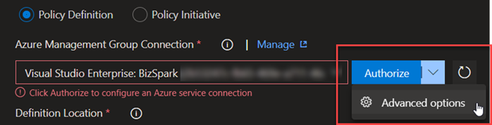
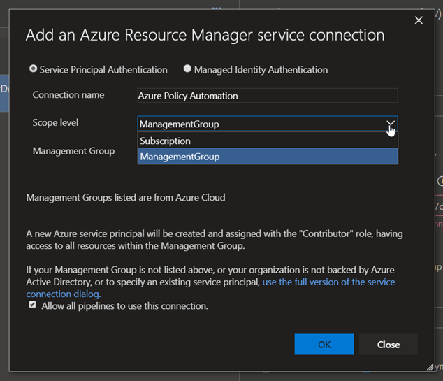

# Create and prepare a Service Connection

This is a small helper document to guide you through on how to create a service connection for the pipeline tasks of this extension.
You can go forward and use Azure DevOps to create a service connection, by choosing any subscription.

**Note:**: Since we will create a service principal that needs access to management groups, we will customize the connection before creating. Since we will use the advanced options (see below)

In the customizable configuration (image below) you choose the scope level "ManagementGroup". Then you should choose a proper connection name and a management group. Since the chosen management group only defines the permission of the service principal and **not** the scope of anything you deploy you should set it to the highest group where you want to be able to deploy everything to (for me mostly the root tenant group).

Alternatively, you can go the more manual way and create an AAD application with Service Principal yourself and add the information into the advanced service connection form.

Either way, the service principal must be added to highest group where you want to be able to deploy. Additionally, you can only use the roles "Owner" or "Resource Policy Contributor" (the latter is recommended, but in preview). These roles are the only one that have write permissions for policies. With these settings in place, they can deploy to any management group or subscription scope that has been defined in the task.

## See Also

* [Create a service connection](https://docs.microsoft.com/en-us/azure/devops/pipelines/library/service-endpoints?view=azure-devops&tabs=yaml#create-a-service-connection)
* [Connect to Microsoft Azure in Azure DevOs](https://docs.microsoft.com/en-us/azure/devops/pipelines/library/connect-to-azure?view=azure-devops)
* [AAD Role 'Resource Policy Contributor'](https://docs.microsoft.com/en-us/azure/role-based-access-control/built-in-roles#resource-policy-contributor)
