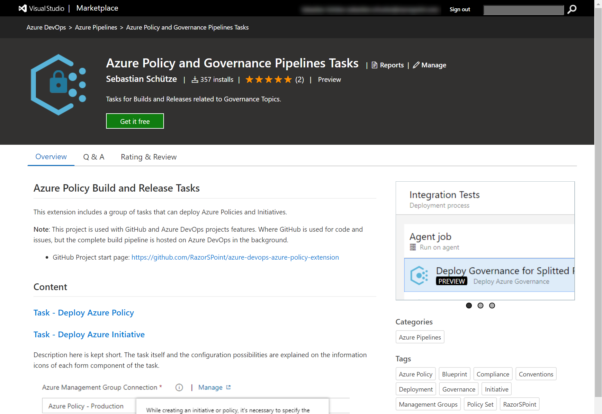
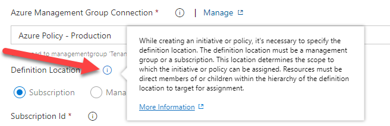

# Azure Policy Build and Release Tasks

This extension for Azure DevOps includes a group of tasks that can deploy Azure Policies and Initiatives. With this it is much easier to updated your policies. Azure DevOps has release templates, but only for the old experience and it only includes inline PowerShell.

## Installation

To install the extension you need your own Azure DevOps organization with the right to install extensions and [go to the marketplace](https://marketplace.visualstudio.com/items?itemName=razorspoint.rp-build-release-azurepolicy) and install it right away.

## Getting Started

Tasks are supposed to be very intuitive if you have basic knowledge of how Azure Policies are constructed. But each task itself provides it's own descriptions which are explained by the information icons of each form component of the task.

## Included Features / Tasks

### Task - Deploy Azure Policy
This task is intended to make it easier for you to publish Azure Policies to your azure tenant.
This tasks needs a Azure Resource Manager service connection with a properly configured service principal.

### Task - Deploy Azure Initiative

This task is intended to make it easier for you to publish Policy Sets (Initiatives) to your azure tenant.
This tasks needs a Azure Resource Manager service connection with a properly configured service principal.
